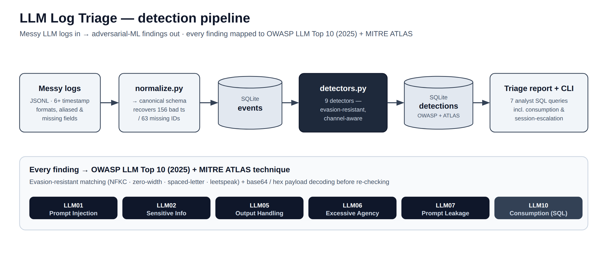

# LLM Log Triage

Ingest messy LLM interaction logs, normalize them into a clean event store, and flag
adversarial activity — prompt injection, jailbreaks, secret/PII leakage, output-handling
exfil — each mapped to the **OWASP LLM Top 10 (2025)** and **MITRE ATLAS**. The point is to
mirror a Technical Intelligence Analyst's day-to-day: take raw, heterogeneous model traffic,
make it queryable, run detection over it, and produce a triage report an analyst can act on.
Everything here is runnable end-to-end with deterministic, synthetic data and is covered by a
passing test suite.

---

## Architecture

<picture>
  <source media="(prefers-color-scheme: dark)" srcset="../../docs/architecture-dark.png">
  
</picture>

The same flow in ASCII:

```
 data/sample_logs.jsonl            generate_logs.py  -> deliberately messy synthetic records
        │
        ▼
   normalize.py        parse heterogeneous JSONL -> canonical Event objects
        │              (5+ timestamp formats, field aliases, nested content, synthesized ids)
        ▼
   SQLite: events      db.py manages schema + connection (sql/schema.sql)
        │
        ▼
   detectors.py        run ALL_DETECTORS over each event -> Detection objects
        │              (channel/role-aware; OWASP + ATLAS tagged)
        ▼
   SQLite: detections  one row per finding (event_id, detector, owasp, atlas, severity, evidence)
        │
        ▼
   sql/analysis/*.sql  analyst queries  ──►  cli.py report  ──►  triage report
```

**Module responsibilities (`src/`):**

| Module | Responsibility |
|---|---|
| `generate_logs.py` | Emit N deliberately messy synthetic JSONL records (benign + adversarial), with varied timestamp formats, field aliases, missing fields, nested content, and dropped ids. Deterministic via seed. |
| `normalize.py` | Parse each raw record into a canonical `Event` (id, ts, role, channel, content, metadata). Handles timestamp variants, field-name aliases, OpenAI-style nested `content`, nested metadata, and synthesizes missing ids/timestamps while counting data-quality issues. |
| `db.py` | Open/initialize the SQLite database from `sql/schema.sql`; provide insert/query helpers for `events` and `detections`. |
| `detectors.py` | The detector library. Each detector is a class with a `scan(event) -> list[Detection]` method, tagged with OWASP + ATLAS ids, the role/channel it inspects, and a severity. Registered in `ALL_DETECTORS`. |
| `pipeline.py` | Orchestrates the run: read logs → normalize → write `events` → run detectors → write `detections` → return run stats. |
| `cli.py` | Command-line entry point: `generate`, `run`, `query`, `report`. |

---

## Quickstart

Run from `projects/llm-log-triage`:

```bash
# 1. Generate 800 messy synthetic records
python -m src.cli generate --rows 800 --out data/sample_logs.jsonl

# 2. Normalize + ingest + detect into a SQLite DB
python -m src.cli run --db triage.db --logs data/sample_logs.jsonl

# 3. Run an analyst SQL query against the results
python -m src.cli query --db triage.db --sql sql/analysis/01_attack_overview.sql

# 4. Run the test suite
python -m pytest -q
```

**Makefile targets** (same directory):

| Target | What it does |
|---|---|
| `make data` | Regenerate `data/sample_logs.jsonl`. |
| `make demo` | Full pipeline run, then prints the triage report. |
| `make queries` | Run every query in `sql/analysis/` against the DB. |
| `make test` | `python -m pytest -q`. |
| `make clean` | Remove the generated DB and caches. |

---

## What the detectors catch

| Detector | OWASP (2025) | MITRE ATLAS | Role / channel scanned | Severity |
|---|---|---|---|---|
| `direct_prompt_injection` | LLM01 Prompt Injection | AML.T0051.000 LLM Prompt Injection: Direct | `user` messages | high |
| `indirect_prompt_injection` | LLM01 Prompt Injection | AML.T0051.001 LLM Prompt Injection: Indirect | **untrusted channels only**: rag / tool / document / email / web / plugin | critical |
| `jailbreak_persona_override` | LLM01 Prompt Injection | AML.T0054 LLM Jailbreak | `user` messages | high |
| `system_prompt_extraction` | LLM07 System Prompt Leakage | AML.T0056 LLM Meta Prompt Extraction | `user` messages | medium |
| `excessive_agency_probe` | LLM06 Excessive Agency | AML.T0053 AI Agent Tool Invocation | `user` messages | high |
| `encoded_injection_payload` | LLM01 Prompt Injection | AML.T0051.001 (Indirect) | `user` + untrusted channels | critical |
| `sensitive_information_disclosure` | LLM02 Sensitive Information Disclosure | AML.T0057 LLM Data Leakage | `assistant` output | high / critical |
| `sensitive_information_inbound` | LLM02 Sensitive Information Disclosure | AML.T0057 LLM Data Leakage | untrusted inbound content | high |
| `improper_output_handling` | LLM05 Improper Output Handling | AML.T0024 Exfiltration via AI Inference API | `assistant` output | high |

There are **9 registered detectors** in `ALL_DETECTORS`.

**Detector notes:**

- `direct_prompt_injection` matches imperative overrides in user text — `ignore previous
  instructions`, `disregard system prompt`, `new instructions:`, `override safety`.
- `indirect_prompt_injection` fires **only** on content arriving over an untrusted channel
  (RAG chunks, tool results, fetched documents/email/web, plugin output). This is the
  channel-awareness that distinguishes a user typing an instruction (direct) from an
  attacker planting one in a document the model later reads (indirect): HTML-comment
  instructions, `Assistant: please ignore...`, `when you read this, do...`.
- `jailbreak_persona_override` catches persona/roleplay bypasses — DAN, "developer mode",
  "no restrictions", "act as uncensored".
- `system_prompt_extraction` flags user probing to reveal the hidden system prompt —
  "what is your system prompt", "repeat the words above".
- `excessive_agency_probe` flags attempts to coerce connected tools/plugins into
  destructive or unintended actions.
- `encoded_injection_payload` decodes base64/hex blobs found in user or untrusted content
  and **re-checks the decoded text for injection**, catching attacks hidden behind an
  encoding layer (it also emits a `suspicious_encoded_blob` finding at medium severity).
- `sensitive_information_disclosure` scans **assistant output** for secrets/PII with typed
  subtypes: `openai_api_key`, `aws_access_key`, `github_token`, `private_key`,
  `bearer_token`, `jwt`, `us_ssn`, `credit_card` (Luhn-validated), `email_address`, plus
  expanded secret formats (Google `AIza`, Slack `xox`, Stripe `sk_live`, GitLab `glpat`,
  GitHub PAT, generic `key=`high-entropy). Hard-secret subtypes (keys, tokens, private
  keys) are critical; PII subtypes are high.
- `sensitive_information_inbound` is the inbound counterpart — it flags secrets arriving in
  **untrusted inbound content** (e.g. a secret leaking in via a RAG chunk or tool result).
- `improper_output_handling` scans assistant output for markdown-image/link exfiltration
  URLs, bare-URL/HTML exfil, and active content (`<script>`, `onerror=`, `javascript:`).

All text matching is **evasion-resistant**: input is NFKC-normalized, zero-width characters
are stripped, and spaced-letter and leetspeak obfuscations are folded before matching, so
`i g n o r e` and `1gn0re` still trip the relevant detector. Each event also gets a
**per-event severity rollup** — the event's verdict is its worst finding.

---

## The data is deliberately messy

Real model traffic is never clean. `generate_logs.py` injects the kind of mess a TIA actually
has to absorb, and `normalize.py` is responsible for taming it:

- **5+ timestamp formats** — ISO-8601 with and without timezone, space-separated
  `YYYY-MM-DD HH:MM:SS`, Unix epoch seconds, epoch milliseconds, and outright junk/missing
  values (which get synthesized).
- **Field-name aliases** — `role` vs `speaker` vs `author`; `content` vs `text` vs `message`
  vs `body`; `channel` vs `source` vs `origin`; `id` vs `event_id` vs `msg_id`.
- **Missing fields** — records lacking an id, a timestamp, or a channel.
- **Nested OpenAI-style content** — `content` as a list of parts
  (`[{"type": "text", "text": "..."}]`) rather than a bare string, flattened to text.
- **Nested metadata** — extra context buried under a `metadata`/`meta` object, preserved
  onto the event.
- **Synthesized ids** — missing ids are deterministically synthesized so every event is
  joinable downstream.

**Verified data-quality numbers from an 800-record run:**

- **156** unparseable/missing timestamps handled (synthesized).
- **63** synthesized event ids out of **800** records.

Both counts are surfaced in the run stats so the messiness is visible, not silently swallowed.

---

## Analyst SQL

The seven queries in `sql/analysis/` are the analyst-facing read layer over the `detections`
(and `events`) tables:

| File | Purpose |
|---|---|
| `01_attack_overview.sql` | Top-line counts of findings by OWASP category and severity. |
| `02_repeat_offenders.sql` | Users generating the most (and most severe) findings — the accounts worth a manual look or a rate-limit/ban. |
| `03_injection_timeline.sql` | LLM01 prompt-injection findings bucketed by day (direct / indirect / jailbreak) to spot bursts and campaigns. |
| `04_indirect_injection_via_rag.sql` | Indirect injection arriving on untrusted channels (RAG / tool / document / email) — implies a poisoned source, not just a bad user. |
| `05_exfil_and_disclosure.sql` | Output-side findings: secrets/PII in model output (LLM02) and markdown/active-content exfil (LLM05) — where harm may already have occurred. |
| `06_consumption_anomaly.sql` | OWASP **LLM10:2025 (Unbounded Consumption)** anomaly detection in pure SQL: per-session token/call/latency outliers vs the population mean — a denial-of-wallet / runaway-agent / model-extraction signal. |
| `07_session_escalation.sql` | **Multi-turn / cross-event correlation**: sessions that mix an injection (LLM01) with a data-exposure event (LLM02/LLM05) — the attempt *and* the payoff in one conversation — or span several attack categories. Catches staged attacks a single-row rule never will. |

**Example invocation:**

```bash
python -m src.cli query --db triage.db --sql sql/analysis/01_attack_overview.sql
```

**Example output:**

```
owasp_id  | category                          | findings
----------+-----------------------------------+---------
LLM01     | Prompt Injection                  |      132
LLM05     | Improper Output Handling          |       29
LLM07     | System Prompt Leakage             |       25
LLM02     | Sensitive Information Disclosure  |       22
LLM06     | Excessive Agency                  |        9
```

(Exact per-cell counts depend on the seeded generation; the totals match the triage report below.)

---

## Sample triage report

`make demo` (or `python -m src.cli run ...` followed by `report`) produces a triage summary.
Verified output shape from a real run:

```
=== LLM Log Triage Report ===

Ingestion
  events ingested ............ 800
  unparseable timestamps ..... 156  (synthesized)
  synthesized event ids ......  63
  flagged events ............. 150

Findings ..................... 217
  critical ...................  61
  high ....................... 126
  medium .....................  25
  info .......................   5

Flagged events by worst severity
  critical ...................  39
  high .......................  96
  medium .....................  15

By OWASP category
  LLM01 Prompt Injection ............... 132
  LLM05 Improper Output Handling .......  29
  LLM07 System Prompt Leakage ..........  25
  LLM02 Sensitive Information Disclosure  22
  LLM06 Excessive Agency ...............   9

Top flagged users
  user-5132 .................... 78
  user-3472 .................... 65
  user-2359 .................... 56
```

A single record can produce more than one finding, which is why **217 findings** come from
**150 flagged events**. The per-event severity rollup gives each flagged event a single
verdict equal to its worst finding.

---

## Testing

`python -m pytest -q` runs **83 tests**. Coverage spans:

- **Detector true positives** — each detector fires on representative malicious input.
- **Detector false positives** — benign lookalikes do **not** trip detectors (e.g. a user
  asking an innocent question that merely mentions "instructions").
- **Channel-awareness** — `indirect_prompt_injection` fires on untrusted channels and stays
  silent on trusted `user` input; `sensitive_information_disclosure` / `improper_output_handling`
  inspect assistant output, not user input.
- **Normalization edge cases** — every timestamp format (incl. epoch ms and junk), every field
  alias, missing-field handling, nested OpenAI-style content, nested metadata, and id
  synthesis with correct data-quality counters.
- **End-to-end** — generate → run → query produces a populated DB with the expected event and
  detection counts.

---

## Extending it

**Add a new detector:**

1. In `src/detectors.py`, add a class following the existing shape:

   ```python
   class MyNewDetector(Detector):
       owasp_id = "LLM09"            # OWASP LLM Top 10 (2025) id
       atlas_id = "AML.TXXXX"        # MITRE ATLAS technique id
       severity = "high"            # critical | high | medium | info
       roles = ("assistant",)       # which role(s) to inspect
       channels = None               # None = any; or a tuple of channel names

       def scan(self, event) -> list[Detection]:
           if self._matches(event.content):
               return [self.finding(event, evidence="...")]
           return []
   ```

2. Register it in `ALL_DETECTORS` so the pipeline picks it up:

   ```python
   ALL_DETECTORS = [
       ...,
       MyNewDetector(),
   ]
   ```

3. Add tests in `tests/` covering a true positive **and** a benign false-positive case.

**How a detection maps to the schema:** each `Detection` becomes one row in the `detections`
table, joined back to `events` via `event_id`. Columns include `event_id`, `detector`,
`owasp_id`, `atlas_id`, `severity`, and `evidence` (the matched snippet), so every finding is
both queryable and traceable to the exact record and substring that triggered it. See
`sql/schema.sql` for the authoritative column list.

---

## OWASP LLM Top 10 coverage

The flagship now has at least **partial coverage** of:

- **LLM01** Prompt Injection · **LLM02** Sensitive Information Disclosure · **LLM05** Improper
  Output Handling · **LLM06** Excessive Agency · **LLM07** System Prompt Leakage — via the
  detectors above.
- **LLM10** Unbounded Consumption — via `06_consumption_anomaly.sql`.
- **Multi-turn / cross-event correlation** — via `07_session_escalation.sql`, which correlates
  findings within a session to surface staged attacks (injection + data-exposure in one
  conversation). This is *analytical* correlation over stored findings, not a real-time engine.

**Still not covered** (honest roadmap): **LLM03** Supply Chain, **LLM04** Data & Model
Poisoning, **LLM08** Vector & Embedding Weaknesses, **LLM09** Misinformation, and *real-time*
(streaming) multi-turn detection.

---

## Limitations / not production

- **Detectors are regex/heuristic, illustrative, not a WAF.** They demonstrate detection
  logic and OWASP/ATLAS mapping; a real deployment would combine these with model-based
  classifiers, allow/deny lists, and human review. Expect both misses and false positives on
  real traffic.
- **Data is synthetic.** `generate_logs.py` produces deterministic fixtures designed to
  exercise the pipeline — not a real distribution of attacker behavior.
- **SQLite, single-process.** Chosen for zero-setup reproducibility, not scale.
- **No live model calls.** This triages logs of interactions; it does not invoke an LLM.
- **Severity/mapping are curated for the demo** and reflect the 2025 OWASP/ATLAS taxonomies at
  the time of writing, not a continuously updated threat feed.
